# The Monk
Dungeon Game created in C++ for the Object-Orientated Programming Module. Completed 14/04/2024.

## Introduction

The Monk, a dungeon exploration game, consists of the user travelling through a dungeon to reach 
the treasure room and finish the game. To get to the treasure room you must pass through empty 
and monster rooms.

The main functionality of the monster room is to try and prevent the user from progressing further 
throughout the dungeon and reaching the treasure room. This is done through a fight against a 
monster within the room. A selection made at the start of the game will determine the difficulty of 
this monster room, enhancing both monster stats and the user’s stats depending on the difficulty 
selected. A turn-based fight then occurs, if the user successfully defeats the monster they will 
progress onto the next room.

The main functionality of the empty room is to aid the user by allowing them to either pray in the 
room to restore their health back to full or continue through the room just passing through. 
Both rooms determine whether the user makes it to the treasure room to finish the game or if their 
character dies within and they lose the game

## Use Case Diagram

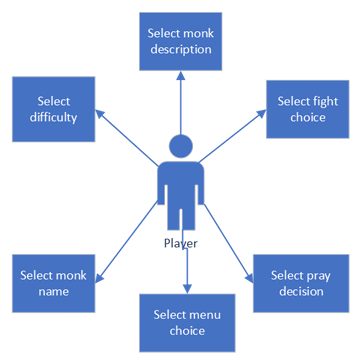

## Activity Diagram

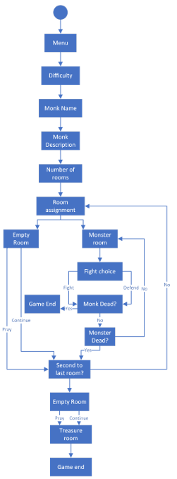

##Class Diagram

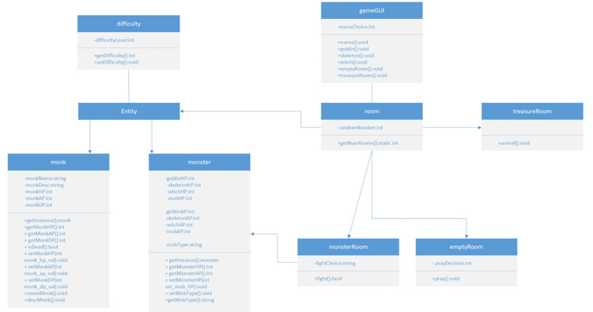

## Design Pattern
- Singleton

## Testing
- Test Cases used:Varying difficulty and menu options.

## Test Cases
- Menu One:

  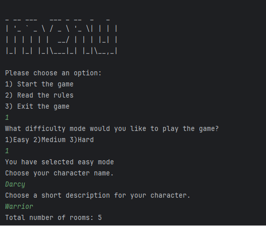

- Menu Two:

  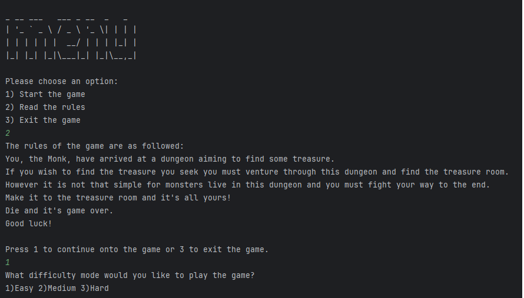

  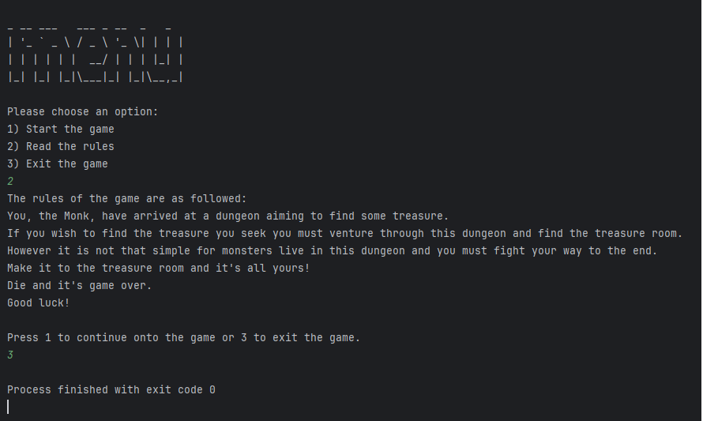

- Menu Three:

  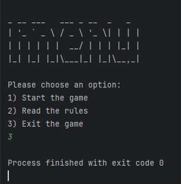

- Difficulty One:

  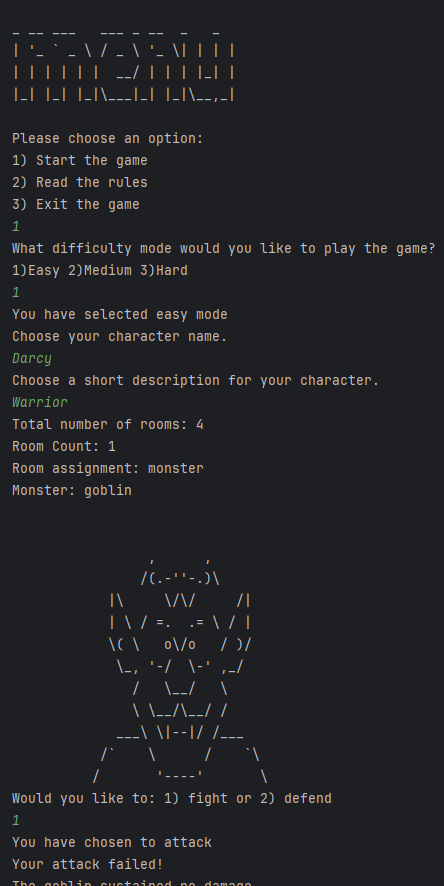

  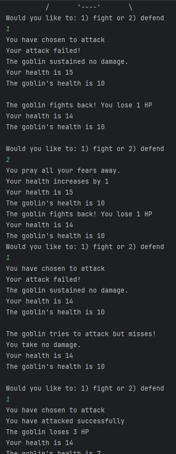

  

  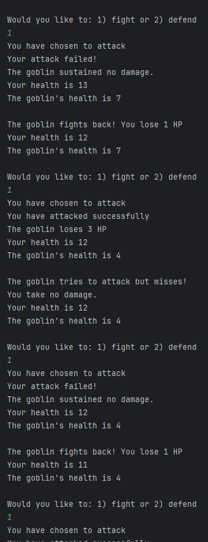

  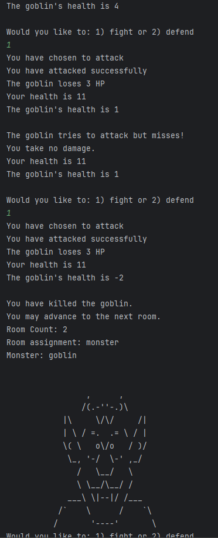

  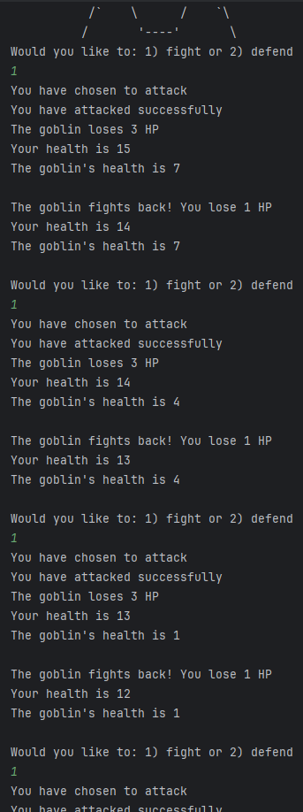

  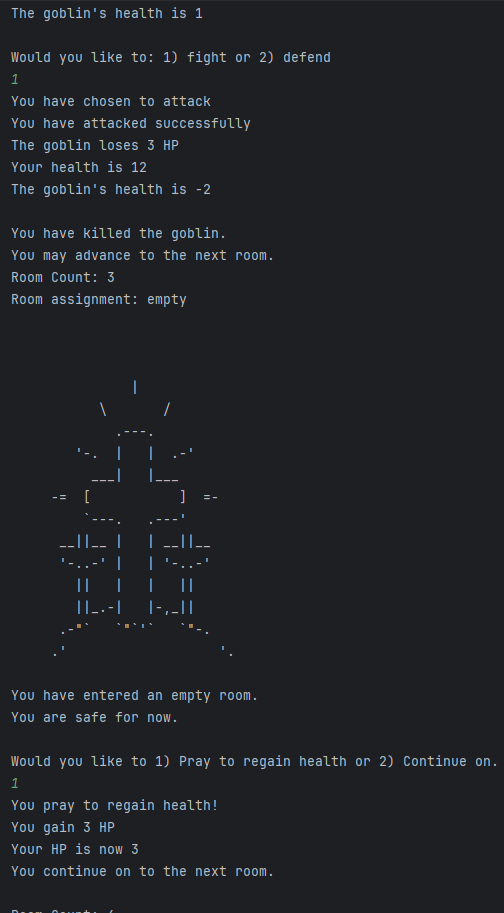

  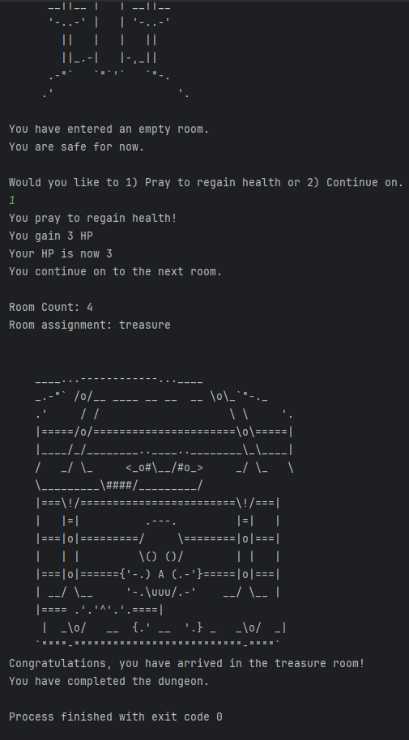

- Difficulty Two:
  
  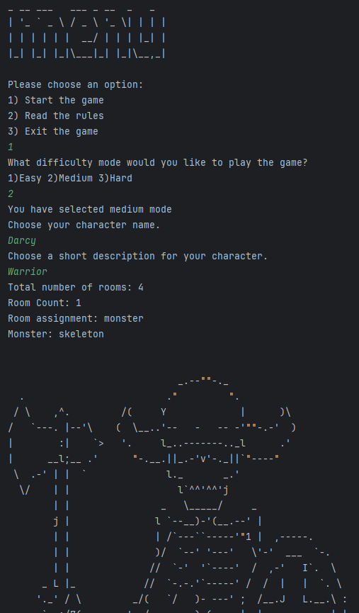

  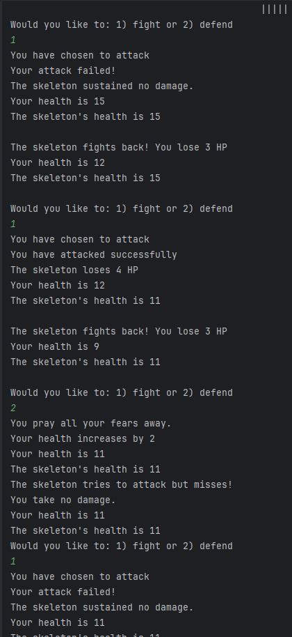

  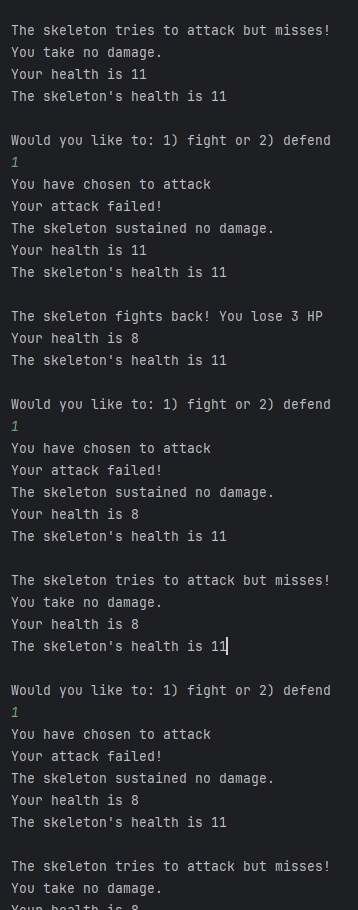

  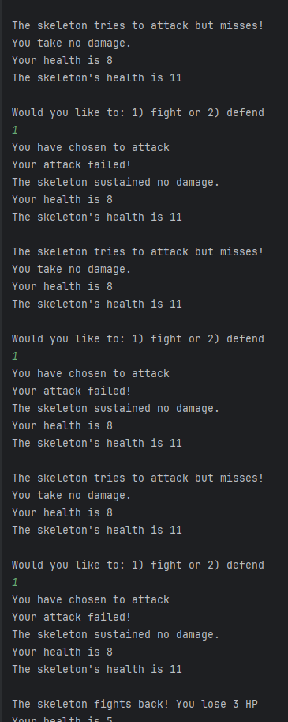

  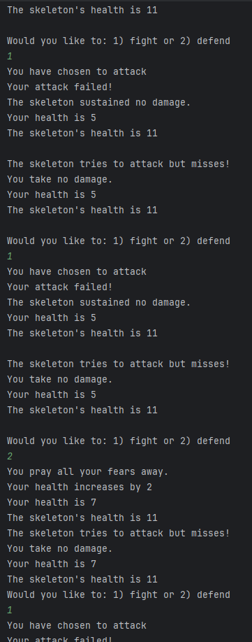

  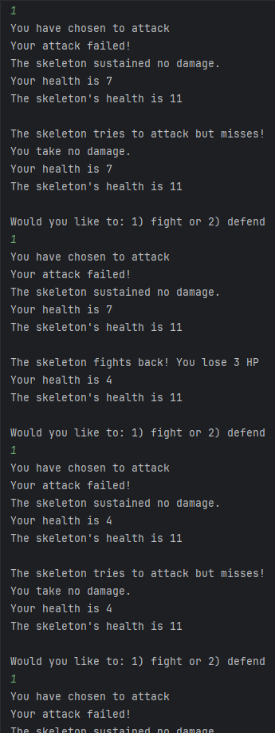

  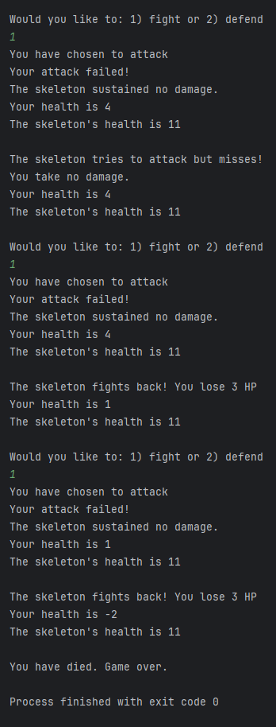
  
- Difficulty Three:

  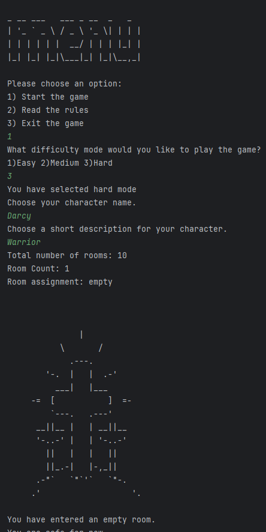

  

  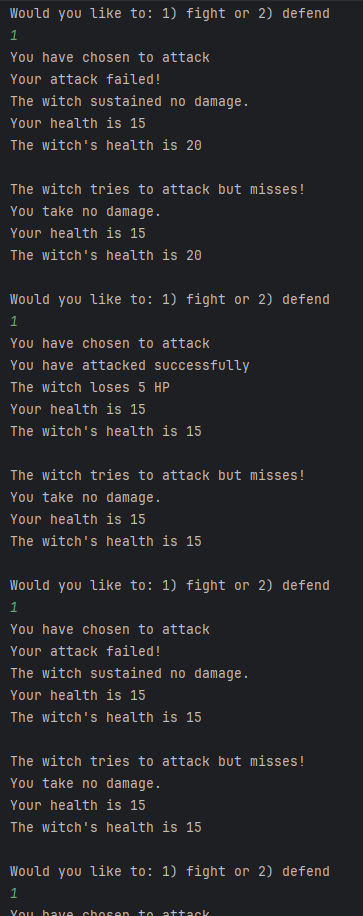

  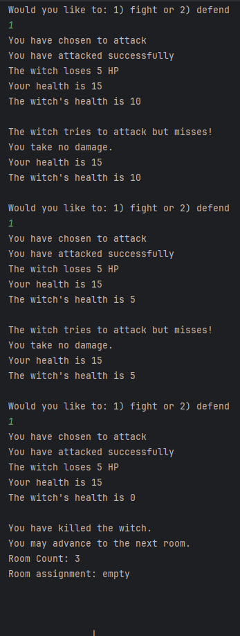

  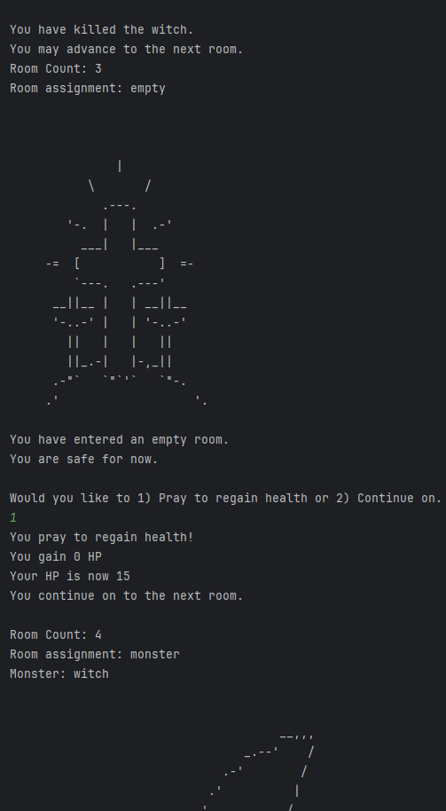

  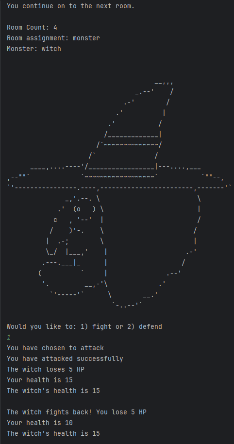

  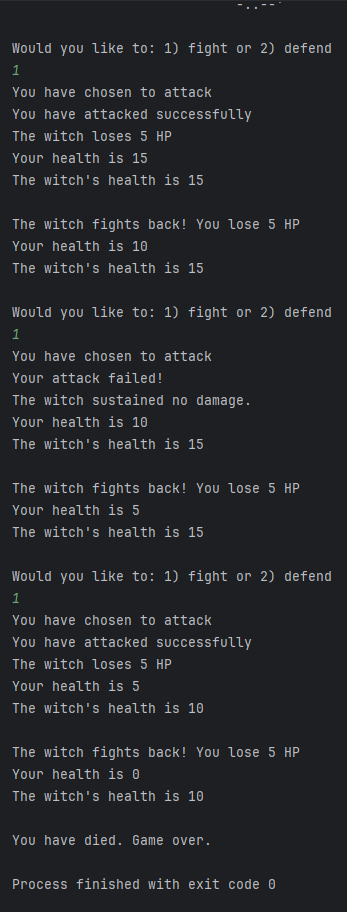
