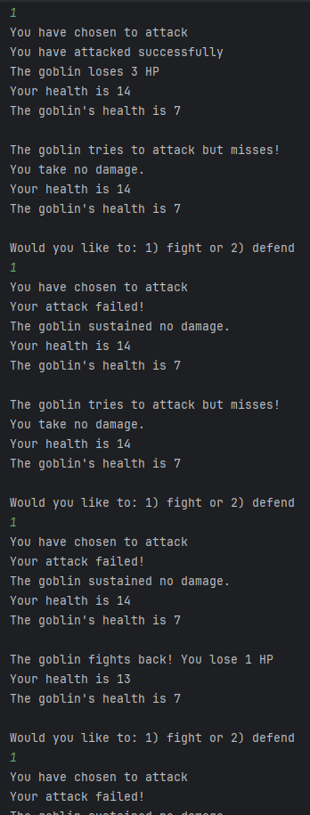
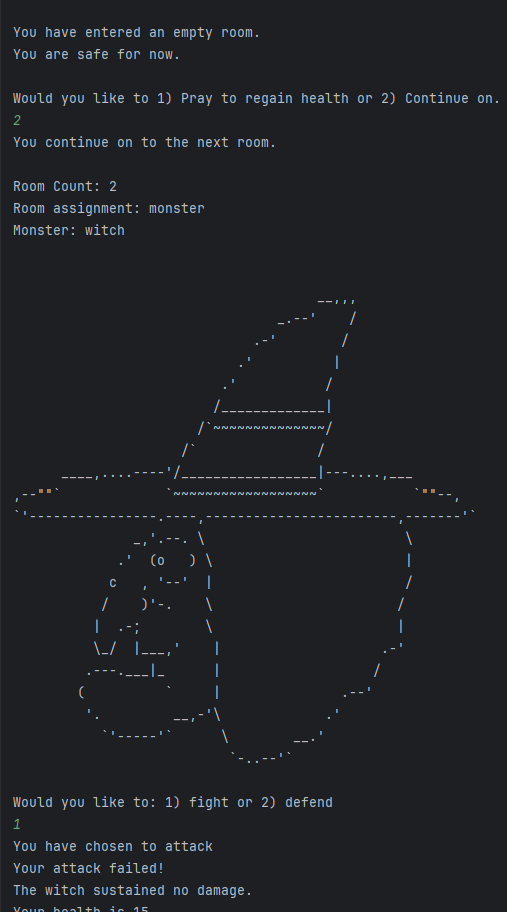

# university-dungeon-game
Dungeon Game created in C++. Completed 14/04/2024

## Introduction

The Monk, a dungeon exploration game, consists of the user travelling through a dungeon to reach 
the treasure room and finish the game. To get to the treasure room you must pass through empty 
and monster rooms.

## Use Case Diagram

## Activity Diagram

##Class Diagram

#Design Pattern
- Singleton

## Testing
- Test Cases used:Varying difficulty and menu options.

## Test Cases
- Menu One:

  

- Menu Two:

  

  

- Menu Three:

  

- Difficulty One:

  

  

  

  

  

  

  

  

- Difficulty Two:
  
  

  

  

  

  

  

  
  
- Difficulty Three:

  

  

  

  

  

  

  
